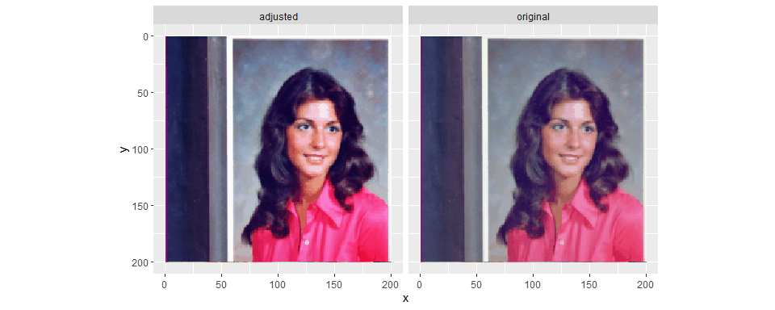

<!-- README.md is generated from README.Rmd. Please edit that file -->

# image-tone-curves

<!-- badges: start -->
<!-- badges: end -->

-   I am experimenting with manually creating and applying tone curves
    to images using R
-   There’s a lot I don’t understand about image processing and colour
    spaces.
-   **This code is very inefficient - it’s more of an
    investigation/experiment on how to do this**

``` r
library(tidyverse)
library(magick)
```

-   Start by reading a test image

``` r
t <- image_read('https://sipi.usc.edu/database/preview/misc/4.1.04.png')
t
```


-   Convert the image to a dataframe
-   Add columns of the red, green and blue pixel values and scale them
    to be between 0 and 1

``` r
t_tmp <-
  t %>% 
  image_raster() %>% 
  mutate(col2rgb(col) %>% t() %>% as_tibble()) %>%
  mutate(across(.cols = c(red, green, blue), 
                .fns = ~scales::rescale(.x, to=c(0,1), from=c(0,255)))) %>% 
  rename(original = col)
```

## A contrast boosting curve

-   Create some x-y points that I can then compute a spline curve from
-   These points will create an ‘s-curve’ that should darken the darker
    tones and lighten the lighter tones (increasing the contrast)

``` r
# Curve dataframe (cdf)
cdf <- 
  tribble(
    ~x, ~y,
    0.0, 0.0,
    0.2, 0.1,
    0.5, 0.5,
    0.8, 0.9,
    1.0, 1.0
  )
```

-   Create the spline function from the x-y points
    -   Different spline methods are available - here I’m using
        `natural`
-   Create a dataframe of the spline curve at higher resolution for
    visualisation
    -   Clip the curve to be between 0 and 1 (valid values of RGB) as
        sometimes the spline smoothing will give values outside the
        range of zero to one

``` r
# Create spline function sf()
sf <- splinefun(x = cdf$x, y = cdf$y, method = "natural")

# Create a curve to visualise the spline function
curve <- 
  tibble(x = seq(0,1,l=100)) %>% 
  mutate(y = sf(x),
         y = case_when(y < 0 ~ 0, y > 1 ~ 1, TRUE ~ y))
```

-   Visualise the curve over the scaled RGB distributions for the
    original image

``` r
ggplot()+
  stat_density(data = t_tmp %>% pivot_longer(cols=c(red, green, blue)),
               mapping = aes(x = value, y=after_stat(scaled), fill=I(name)),
               alpha=0.5)+
  geom_line(data = cdf, aes(x, x), lty=2)+
  geom_point(data = cdf, aes(x, y))+
  geom_line(data = curve, aes(x, y))+
  facet_wrap(~name)+
  coord_equal()+
  scale_x_continuous("Input", breaks = seq(0,1,l=11))+
  scale_y_continuous("Output", breaks = seq(0,1,l=11))+
  scale_fill_manual(values = c(green = "green3", blue="blue", red="red"))+
  theme(legend.position = "none")
```

<!-- -->

-   Apply the spline function to each of the RGB channels
    -   Also applying the clipping of RGB values to be between 0 and 1
-   A different curve could be applied to each of the RGB channels

``` r
t_tmp %>%
  mutate(across(.cols = c(red, green, blue), .fns = sf)) %>%
  mutate(across(.cols = c(red, green, blue), 
                .fns = ~case_when(.x < 0 ~ 0, .x > 1 ~ 1, TRUE ~ .x))) %>%
  mutate(adjusted = rgb(red, green, blue)) %>%
  pivot_longer(cols=c(original, adjusted)) %>%
  ggplot()+
  geom_raster(aes(x, y, fill=I(value)))+
  scale_y_reverse()+
  coord_equal()+
  facet_wrap(~name)
```

<!-- -->

## Another example

### Increasing brightness curve

``` r
t <- image_read('https://sipi.usc.edu/database/preview/misc/4.1.02.png')

t_tmp <-
  t %>% 
  image_raster() %>% 
  mutate(col2rgb(col) %>% t() %>% as_tibble()) %>%
  mutate(across(.cols = c(red, green, blue), 
                .fns = ~scales::rescale(.x, to=c(0,1), from=c(0,255)))) %>% 
  rename(original = col)

# Curve dataframe (cdf)
cdf <- 
  tribble(
    ~x, ~y,
    0.0, 0.0,
    0.1, 0.30,
    0.4, 0.75,
    1.0, 1.0
  )

# Create spline function sf()
sf <- splinefun(x = cdf$x, y = cdf$y, method = "natural")

# Create a curve to visualise the spline function
curve <- 
  tibble(x = seq(0,1,l=100)) %>% 
  mutate(y = sf(x),
         y = case_when(y < 0 ~ 0, y > 1 ~ 1, TRUE ~ y))

ggplot()+
  stat_density(geom ="area",
               data = t_tmp %>% pivot_longer(cols=c(red, green, blue)),
               mapping = aes(x = value, y=after_stat(scaled), fill=I(name)),
               position="identity",
               alpha=0.5)+
  geom_line(data = cdf, aes(x, x), lty=2)+
  geom_point(data = cdf, aes(x, y))+
  geom_line(data = curve, aes(x, y))+
  facet_wrap(~name)+
  coord_equal()+
  scale_x_continuous("Input", breaks = seq(0,1,l=11))+
  scale_y_continuous("Output", breaks = seq(0,1,l=11))+
  scale_fill_manual(values = c(green = "green3", blue="blue", red="red"))+
  theme(legend.position = "none")
```

<!-- -->

``` r
t_tmp %>%
  mutate(across(.cols = c(red, green, blue), .fns = sf)) %>%
  mutate(across(.cols = c(red, green, blue), 
                .fns = ~case_when(.x < 0 ~ 0, .x > 1 ~ 1, TRUE ~ .x))) %>%
  mutate(adjusted = rgb(red, green, blue)) %>%
  pivot_longer(cols=c(original, adjusted)) %>%
  ggplot()+
  geom_raster(aes(x, y, fill=I(value)))+
  scale_y_reverse()+
  coord_equal()+
  facet_wrap(~name)
```

<!-- -->
